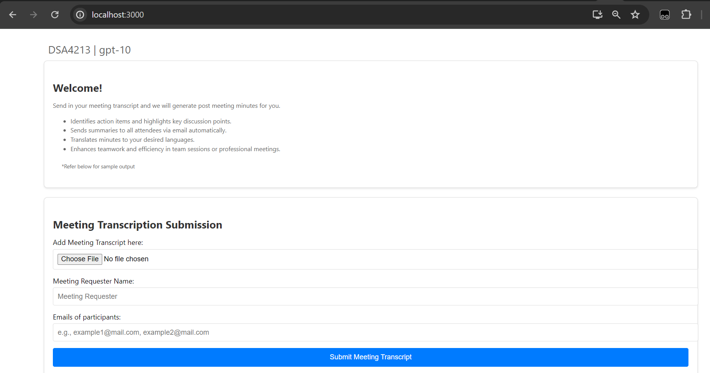
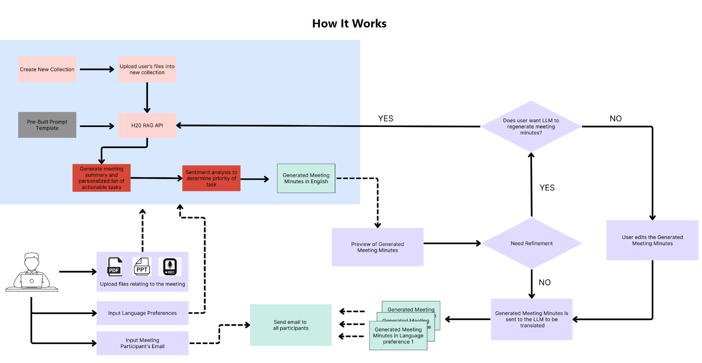
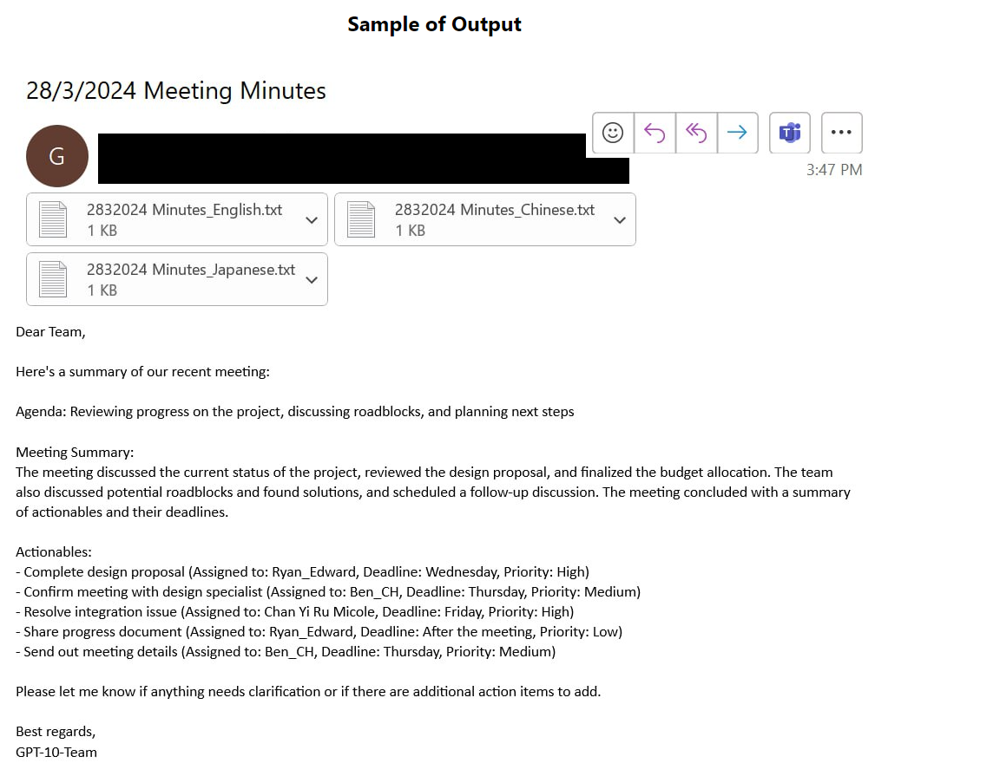
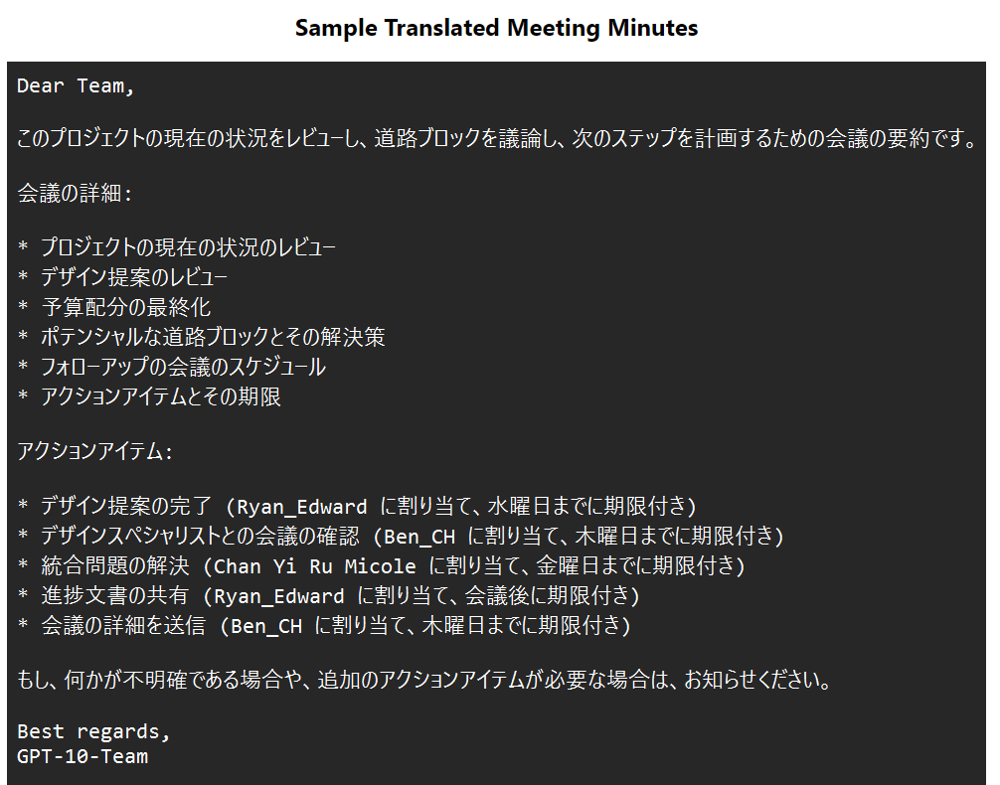

# GPT-10: DSA4213 Project

### Description:
Introducing our post-meeting summarizer and multi-lingual assistant, designed to streamline organizational workflows. This app automates the extraction of key insights and action items, enhancing productivity and collaboration across teams. 

### Our application


### How our application works


### Sample output email sent


### Sample of translated meeting minutes


### Git Repository Structure
```
└── 📁Flask_app
    └── 📁blueprints
        └── 📁cleanup
            └── cleanup.py
        └── 📁get_LLM_response
            └── get_LLM_response.py
            └── prompts.py
        └── 📁meeting_chat
            └── meeting_chat.py
        └── 📁send_email
            └── send_email.py
        └── 📁translate
            └── translate.py
    └── main.py
    └── README.md
    └── requirements.txt
    └── utils.py
└── 📁frontend
    └── 📁frontend-app
        └── 📁.yarn
        └── 📁index
            └── index.py
            └── 📁templates
                └── 📁index
        └── 📁public
        └── 📁src
            └── 📁Screens
                └── 📁Confirmation
                └── 📁Loading
                └── 📁Review
                └── 📁StartScreen
                    └── 📁icons
                    └── 📁images
            └── 📁Utils
                └── 📁icons
    └── README.md
└── 📁Images
    └── homepage.png
    └── sampleEmail.png
    └── sampleTranslate.png
    └── workflow.png
└── 📁Prompt
    └── 📁Data
    └── Prompt_experimentation.ipynb
    └── requirements.txt
└── Dockerfile
└── entrypoint.sh
└── README.md
└── sample_meeting_transcript.txt
```
<details>
<summary>Folder description</summary>

- 📁Flask_app: This is the backend of the application. It contains the Flask server and all the blueprints for the different functionalities.
    - 📁blueprints: This folder contains different modules for the functionalities of the application.
        - 📁cleanup: This module is responsible for cleaning up the data.
            - cleanup.py: This file contains the code for the cleanup process.
        - 📁get_LLM_response: This module is responsible for getting responses from the LLM.
            - get_LLM_response.py: This file contains the code for getting responses.
            - prompts.py: This file contains the prompts for the LLM.
        - 📁meeting_chat: This module is responsible for handling the meeting chat.
            - meeting_chat.py: This file contains the code for the meeting chat.
        - 📁send_email: This module is responsible for sending emails.
            - send_email.py: This file contains the code for sending emails.
        - 📁translate: This module is responsible for translating text.
            - translate.py: This file contains the code for translation.
    - main.py: This is the main file that runs the Flask server.
    - README.md : README for the backend
    - requirements.txt
    - utils.py: This file contains utility functions used across the application.
    - .env_sample : This is a sample of what the actual .env file should contain. 
    - .env : This .env file is not provided. It should minimally contain the contents of .env_sample for the code to run smoothly. Refer below for steps on creating a .env file.
- 📁frontend: This is the frontend of the application. It contains the React app.
    - 📁frontend-app: This folder contains the React application.
        - 📁.yarn: This folder contains Yarn related files.
        - 📁public: This folder contains public assets like images, icons, etc.
        - 📁src: This folder contains the source code for the React app.
            - 📁Screens: This folder contains the different screens of the app.
                - 📁Confirmation: This folder contains the Confirmation screen.
                - 📁Loading: This folder contains the Loading screen.
                - 📁Review: This folder contains the Review screen.
                - 📁StartScreen: This folder contains the Start screen.
                    - 📁icons: This folder contains the icons for the Start screen.
                    - 📁images: This folder contains the images for the Start screen.
            - 📁Utils: This folder contains utility functions used across the application.
                - 📁icons: This folder contains the icons for the Utils.
    - README: README for the frontend.
- 📁Images: This folder contains images of our application and outputs.
- 📁Prompt: This folder contains the code ww ran while experimenting different prompts
    - 📁Data: This folder contains sample data that to test the prompts.
- Dockerfile: This file is used to create a Docker image for the application.
- entrypoint.sh: This script is executed at the start of the Docker container. It starts up both the backend and frontend.
- README.md: This is the main README file for the project. It provides an overview of the project and instructions on how to use the application.
- sample_meeting_transcript.txt: This is a sample transcript file that can be used to test the application.
</details>

### Usage
#### We have 2 ways to use the application
1. Using Docker and 
2. Running the application locally

#### Using Docker
1. Ensure Docker is installed on your machine. If not, you can download it from [Docker's official website](https://www.docker.com/products/docker-desktop).
2. Ensure that you are in the `gpt-10/` directory
3. Build the Docker image for the application. In the project root directory by running the command `docker build -t dsa4213-app-1 .`.
4. Once the image is built, you can run the application using the command `docker run -p 3000:3000 -p 5000:5000 dsa4213-app-1 `.
5. Open your web browser and visit `http://localhost:3000` to use the application.

#### Running the application locally
1. Clone the repository to your local machine.
2. Ensure that Node.js, Yarn, and Python are installed on your machine. If not, you can download them from their official websites:
    - [Node.js](https://nodejs.org/en/download/)
    - [Yarn](https://classic.yarnpkg.com/en/docs/install/#windows-stable)
    - [Python](https://www.python.org/downloads/)
3. Navigate to the project directory `cd gpt-10`.
4. Install the necessary dependencies:
    - For the Flask app, navigate to the Flask_app directory `cd Flask_app` and run `pip install -r requirements.txt`.
    - For the frontend, navigate to the frontend/frontend-app directory `cd frontend/frontend-app` and run `yarn`.
5. Create `.env` file in the `Flask_app/` directory. cd into the Flask_app directory `cd Flask_app` and create a `.env` file to store environment variables. A sample `.env` file has been provided at `.env_sample`. If you face errors creating a `.env` file, you may create text file containing the same contents as what you would put in the `.env`. Then edit the code in `Flask_app/main.py` and change `load_dotenv()` to `load_dotenv(path_to_alternative_env_file)` and save the code.
6. Start the Flask app by running `python main.py` in the Flask_app directory.
7. In a new terminal, start the frontend by navigating to the frontend/frontend-app directory and running `yarn start`.
8. Open your web browser and visit `http://localhost:3000` to use the application.


<br>
<br>

Other information:
This application were developed and tested on windows machines. Python 3.12.2 was used in the development.